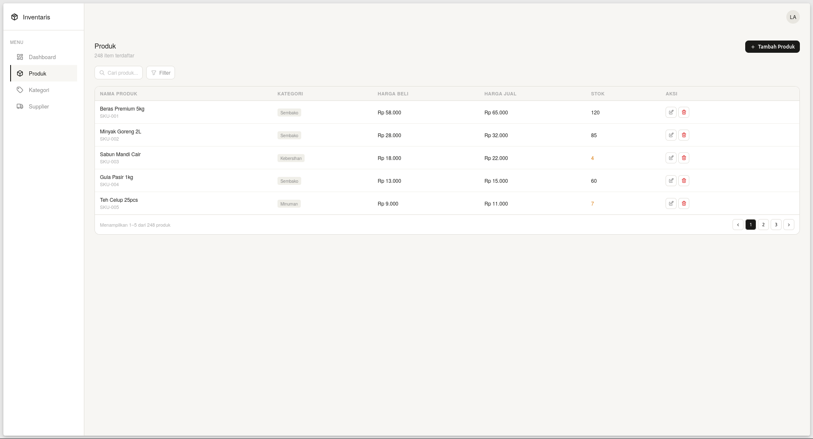
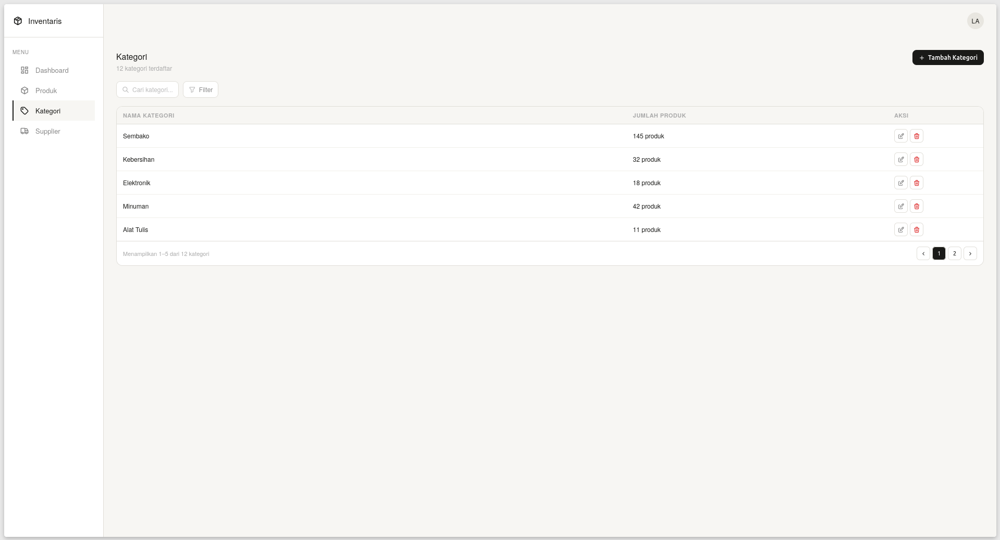

# inventaris-manajemen
This is a personal project for portofolio about Inventory Management using vanilla HTML-CSS-JS and Golang.

## Tech Stack
- **Frontend**: HTML5, CSS3, Vanilla JS, Tabler Icons
- **Interactivity**: HTMX (for seamless partial page updates)
- **Backend**: Golang (Standard Library)

## Preview
### Login Page

### Dashboard Content

### Produk Page

### Kategori Page

### Supplier Page

## Updates
- **28-05-2026** : adding HTMX to the stack for "easier javascript :D"
- **29-05-2026** : adding kategori.html and supplier.html for that related feature. now it is fully complete, even tho it is still using dummy data.
