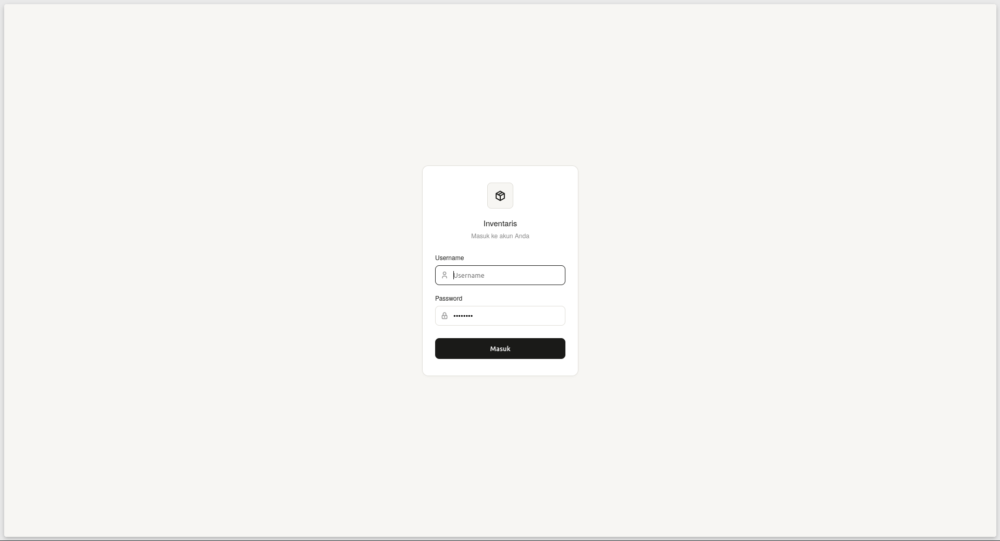
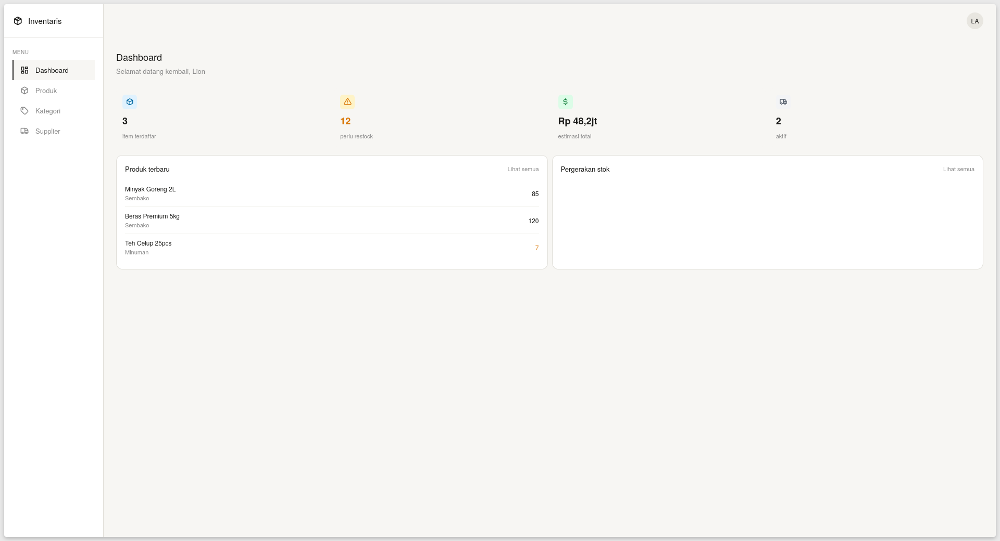
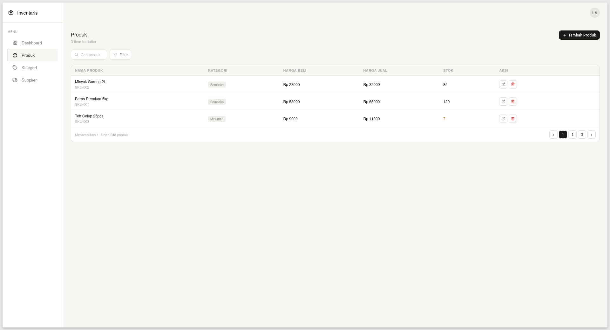
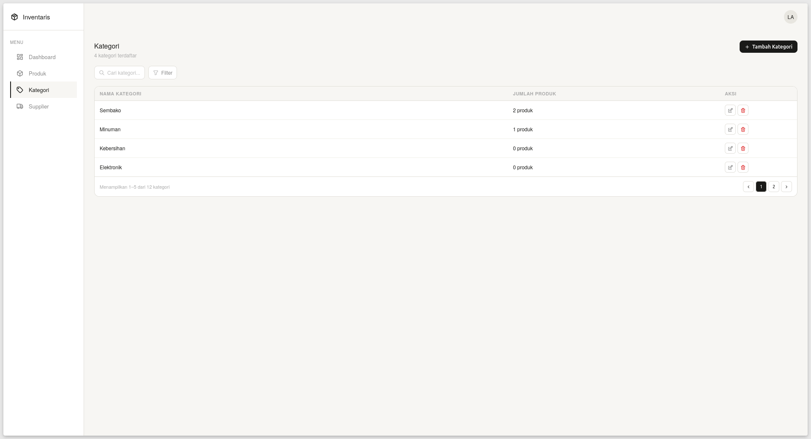
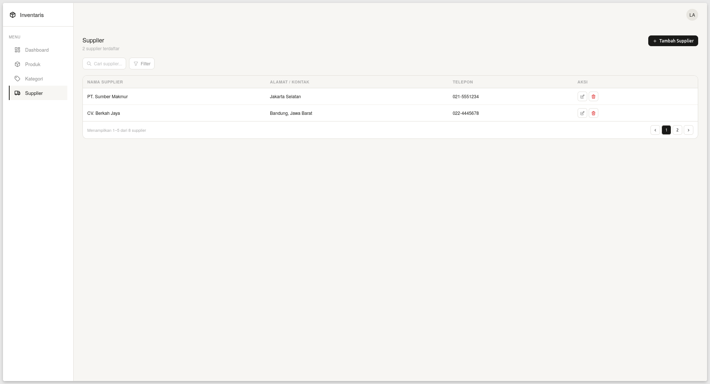

# inventaris-manajemen
This is a personal project for portofolio about Inventory Management using vanilla HTML-CSS-JS and Golang.

## Key Features
- **Authentication**: Secure access via login page.
- **Inventory Control**: View products, categories, and suppliers fetched live from a PostgreSQL database.
- **Seamless Experience**: Utilizing HTMX for partial page updates to avoid repetitive full-page refreshes.

## Tech Stack
- **Frontend**: HTML5, CSS3, Vanilla JS, Tabler Icons
- **Interactivity**: HTMX (for seamless partial page updates)
- **Backend**: Golang (Standard Library)
- **Database**: PostgreSQL (via pgx v5)

## Setup
1. Install PostgreSQL and create a database:
```bash
   sudo -u postgres psql
   CREATE DATABASE inventaris;
   \q
   sudo -u postgres psql -d inventaris -f schema.sql
```
2. Copy `.env.example` to `.env` and fill in your database credentials.
3. Run the app:
```bash
   go run .
```

## Preview
### Login Page


### Dashboard Content


### Produk Page


### Kategori Page


### Supplier Page

